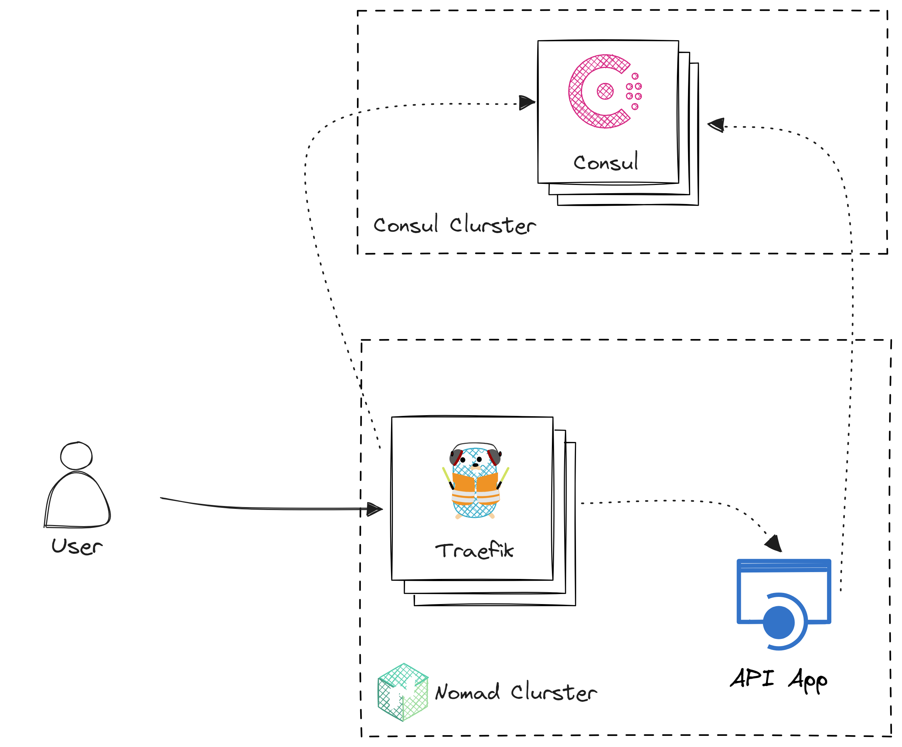

# Rent Car


[](https://sonarcloud.io/summary/new_code?id=foxminchan_RentCar)

## Description

<p align="justify">
<b>RentCar</b> adopts Clean Architecture and Domain-Driven Design (DDD) to optimize car rental processes, featuring reservation interfaces, fleet management tools, availability tracking, and potential payment integration. The emphasis is on achieving a scalable, maintainable, and domain-centric design.
</p>

## Prerequisites

- [Node.js](https://nodejs.org/en/)
- [pnpm](https://pnpm.io/)
- [.NET 8.0](https://dotnet.microsoft.com/download/dotnet/8.0)
- [Docker](https://www.docker.com/)
- [Nomad](https://www.nomadproject.io/)
- [Consul](https://www.consul.io/)
- [Vault](https://www.vaultproject.io/)
- [Terraform](https://www.terraform.io/)
- [Nuke](https://nuke.build/)

## Installation and Setup

Clone the repository:

```bash
git clone https://github.com/foxminchan/RentCar.git
```

Install necessary tools:

```bash
pnpm install

dotnet tool install dotnet-ef -g
dotnet tool install Nuke.GlobalTool --global
```

## Running the Application

<p align="justify">
To run the application, you can do this by running the following command:
</p>

```bash
dotnet watch -p ./src/RentCar.Usecase/ run -lp https
```

## OpenTelemetry

RentCar uses [OpenTelemetry](https://opentelemetry.io/) to collect logs, metrics, and traces. The following are the services that are currently supported:

You can view the metrics and traces by running the following command:

```bash
docker-compose ./docker/docker-compose.o11y.yml up
```

> For sebp/elk, you need to run the following command to increase the virtual memory:
>
> ```bash
> sudo sysctl -w vm.max_map_count=262144
> ```

## Cloudinary Configuration

<p align="justify">
Navigate to the <a href="https://cloudinary.com/console">Cloudinary Console</a> and create a new Cloudinary account. Once you have created your account, you will be able to view your account's <b>Cloud name</b>, <b>API Key</b>, and <b>API Secret</b> in the <b>Dashboard</b> section. Then, you need to add the following configuration to the <code>appsettings.json</code> file:
</p>

```json
"CloudinarySetting": {
  "CloudName": "Enter your cloud name",
  "ApiKey": "Enter your api key",
  "ApiSecret": "Enter your api secret"
},
```

## Start HashiCorp Stack

<p align="justify">
For the deployment, RentCar uses the HashiCorp stack, which consists of Nomad, Consul, and Vault. It is a set of open-source tools that enable you to provision, secure, and run any infrastructure for any application. The following is the architecture of the HashiCorp stack:
</p>



<p align="justify">
To start the HashiCorp stack, you need to start the Nomad, Consul, and Vault servers. You can do this by running the following command:
</p>

> [!IMPORTANT]
>
> Make you have installed tools in the [Prerequisites](#prerequisites) section.

```bash
cd build/local
./start.sh
```

<p align="justify">
To use Terraform to provisioning the API, you need to run the following command:
</p>

```bash
cd build/nomad
terraform init
terraform apply
```

<p align="justify">
For clean up, you need to run the following command:
</p>

```bash
cd build/nomad
terraform destroy
```

## License

This project is licensed under the MIT License - see the [LICENSE](LICENSE) file for details.
